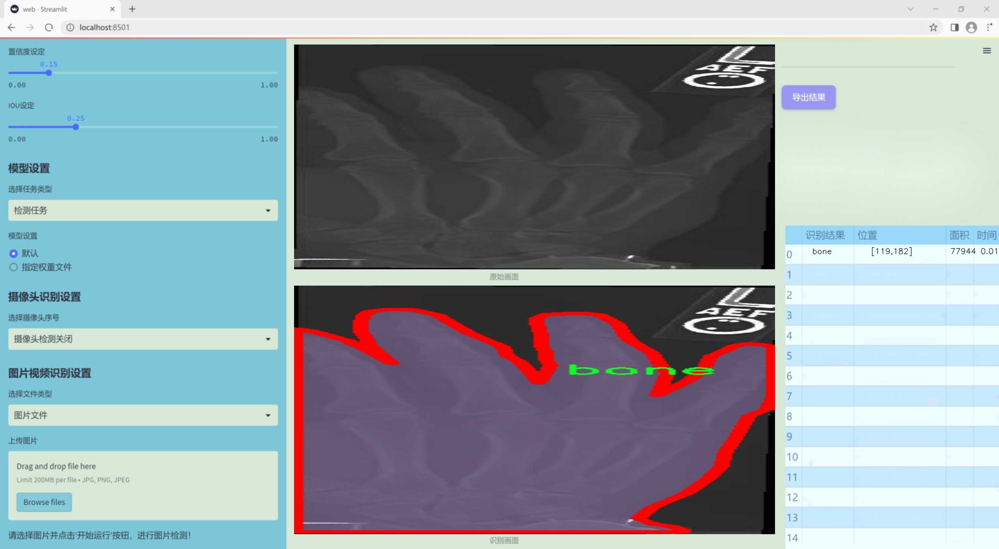
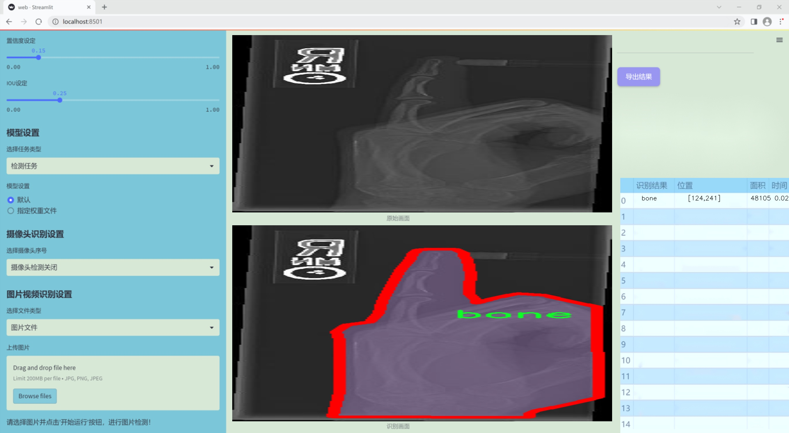
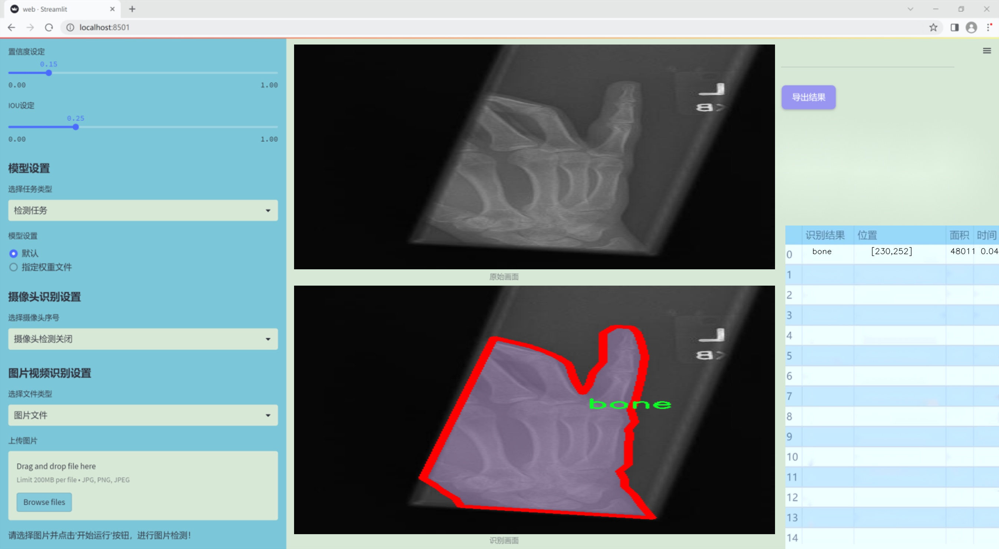
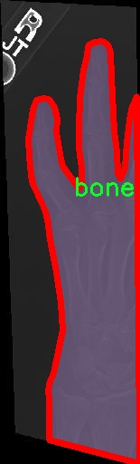
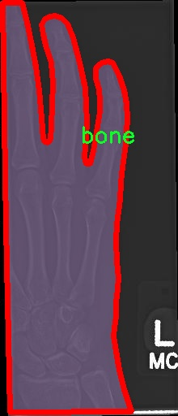
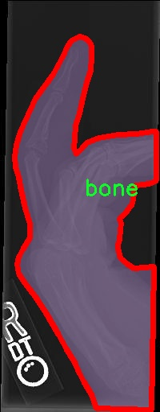
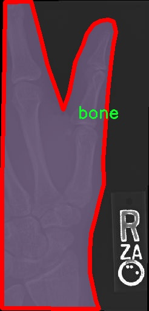
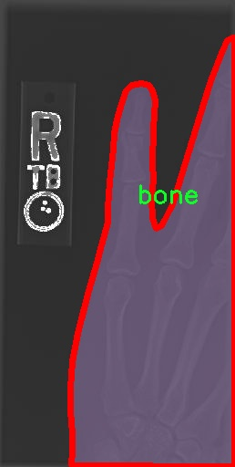

### 1.背景意义

研究背景与意义

骨折作为一种常见的骨骼损伤，其诊断和治疗对患者的康复至关重要。传统的骨折检测方法主要依赖于医生的经验和影像学检查，如X光、CT等，这不仅耗时，而且容易受到主观因素的影响。随着计算机视觉和深度学习技术的迅猛发展，基于人工智能的自动化骨折检测系统逐渐成为研究热点。特别是YOLO（You Only Look Once）系列模型因其高效的实时检测能力，已被广泛应用于各类物体检测任务中。

本研究旨在基于改进的YOLOv11模型，构建一个高效的骨折检测系统。我们采用了一个包含4000张图像的数据集，专注于骨骼类别的检测。该数据集经过精心标注，确保了模型训练的准确性和有效性。通过对YOLOv11模型的改进，我们希望在检测精度和速度上实现显著提升，以满足临床应用的需求。

在骨折检测领域，准确的早期诊断可以显著提高治疗效果，减少并发症的发生。我们的研究不仅有助于提高骨折检测的自动化水平，还能为医生提供辅助决策支持，减轻其工作负担。此外，基于深度学习的骨折检测系统能够通过不断学习和优化，适应不同类型的骨折情况，从而在实际应用中展现出更强的灵活性和适应性。

总之，基于改进YOLOv11的骨折检测系统的研究，不仅具有重要的学术价值，也对临床医学实践具有深远的影响。通过提高骨折检测的效率和准确性，我们期望为患者提供更优质的医疗服务，推动骨科领域的技术进步。

### 2.视频效果

[2.1 视频效果](https://www.bilibili.com/video/BV1hGqrYiE9b/)

### 3.图片效果







##### [项目涉及的源码数据来源链接](https://kdocs.cn/l/cszuIiCKVNis)**

注意：本项目提供训练的数据集和训练教程,由于版本持续更新,暂不提供权重文件（best.pt）,请按照6.训练教程进行训练后实现上图演示的效果。

### 4.数据集信息

##### 4.1 本项目数据集类别数＆类别名

nc: 1
names: ['bone']


该项目为【图像分割】数据集，请在【训练教程和Web端加载模型教程（第三步）】这一步的时候按照【图像分割】部分的教程来训练

##### 4.2 本项目数据集信息介绍

本项目数据集信息介绍

本项目旨在开发和改进基于YOLOv11的骨折检测系统，为此我们构建了一个专门的数据集，以支持深度学习模型的训练和评估。该数据集的核心主题为“Convert COCO JSON to Yolov7 TXT”，通过这一过程，我们将COCO格式的数据转换为YOLO所需的TXT格式，以便于更高效地进行模型训练和推理。数据集中包含的类别数量为1，具体类别为“bone”，这表明我们的模型专注于识别和检测骨折相关的图像信息。

在数据集的构建过程中，我们精心挑选了大量的医学影像数据，包括X光片、CT扫描图像等，这些图像均标注了骨折的具体位置和类型。通过对这些数据的标注，我们确保了模型能够学习到骨折的特征，从而在实际应用中实现高效、准确的检测。为了提高模型的泛化能力，我们的数据集涵盖了不同类型的骨折，包括但不限于横断骨折、斜骨折和粉碎骨折等。这种多样性使得模型在面对不同病例时，能够更好地适应和识别。

此外，为了增强数据集的鲁棒性，我们还进行了数据增强处理，包括旋转、缩放、翻转等操作。这些处理不仅丰富了数据集的多样性，还有效提升了模型在真实场景中的表现。通过对数据集的不断优化和扩充，我们期望最终构建出一个能够在临床环境中提供高效、准确骨折检测的系统，为医疗工作者提供有力的支持，提升骨折诊断的效率和准确性。











### 5.全套项目环境部署视频教程（零基础手把手教学）

[5.1 所需软件PyCharm和Anaconda安装教程（第一步）](https://www.bilibili.com/video/BV1BoC1YCEKi/?spm_id_from=333.999.0.0&vd_source=bc9aec86d164b67a7004b996143742dc)


[5.2 安装Python虚拟环境创建和依赖库安装视频教程（第二步）](https://www.bilibili.com/video/BV1ZoC1YCEBw?spm_id_from=333.788.videopod.sections&vd_source=bc9aec86d164b67a7004b996143742dc)

### 6.改进YOLOv11训练教程和Web_UI前端加载模型教程（零基础手把手教学）

[6.1 改进YOLOv11训练教程和Web_UI前端加载模型教程（第三步）](https://www.bilibili.com/video/BV1BoC1YCEhR?spm_id_from=333.788.videopod.sections&vd_source=bc9aec86d164b67a7004b996143742dc)


按照上面的训练视频教程链接加载项目提供的数据集，运行train.py即可开始训练



     Epoch   gpu_mem       box       obj       cls    labels  img_size
     1/200     20.8G   0.01576   0.01955  0.007536        22      1280: 100%|██████████| 849/849 [14:42<00:00,  1.04s/it]
               Class     Images     Labels          P          R     mAP@.5 mAP@.5:.95: 100%|██████████| 213/213 [01:14<00:00,  2.87it/s]
                 all       3395      17314      0.994      0.957      0.0957      0.0843

     Epoch   gpu_mem       box       obj       cls    labels  img_size
     2/200     20.8G   0.01578   0.01923  0.007006        22      1280: 100%|██████████| 849/849 [14:44<00:00,  1.04s/it]
               Class     Images     Labels          P          R     mAP@.5 mAP@.5:.95: 100%|██████████| 213/213 [01:12<00:00,  2.95it/s]
                 all       3395      17314      0.996      0.956      0.0957      0.0845

     Epoch   gpu_mem       box       obj       cls    labels  img_size
     3/200     20.8G   0.01561    0.0191  0.006895        27      1280: 100%|██████████| 849/849 [10:56<00:00,  1.29it/s]
               Class     Images     Labels          P          R     mAP@.5 mAP@.5:.95: 100%|███████   | 187/213 [00:52<00:00,  4.04it/s]
                 all       3395      17314      0.996      0.957      0.0957      0.0845


###### [项目数据集下载链接](https://kdocs.cn/l/cszuIiCKVNis)

### 7.原始YOLOv11算法讲解


##### YOLO11介绍

Ultralytics YOLO11是一款尖端的、最先进的模型，它在之前YOLO版本成功的基础上进行了构建，并引入了新功能和改进，以进一步提升性能和灵活性。
**YOLO11设计快速、准确且易于使用，使其成为各种物体检测和跟踪、实例分割、图像分类以及姿态估计任务的绝佳选择。**


**结构图如下：**


##### **C3k2**

**C3k2，结构图如下**


**C3k2，继承自类`C2f，其中通过c3k设置False或者Ture来决定选择使用C3k还是`**Bottleneck


**实现代码** **ultralytics/nn/modules/block.py**

##### C2PSA介绍

**借鉴V10 PSA结构，实现了C2PSA和C2fPSA，最终选择了基于C2的C2PSA（可能涨点更好？）**


**实现代码** **ultralytics/nn/modules/block.py**

##### Detect介绍

**分类检测头引入了DWConv（更加轻量级，为后续二次创新提供了改进点），结构图如下（和V8的区别）：**


### 8.200+种全套改进YOLOV11创新点原理讲解

#### 8.1 200+种全套改进YOLOV11创新点原理讲解大全

由于篇幅限制，每个创新点的具体原理讲解就不全部展开，具体见下列网址中的改进模块对应项目的技术原理博客网址【Blog】（创新点均为模块化搭建，原理适配YOLOv5~YOLOv11等各种版本）

[改进模块技术原理博客【Blog】网址链接](https://gitee.com/qunmasj/good)


#### 8.2 精选部分改进YOLOV11创新点原理讲解

###### 这里节选部分改进创新点展开原理讲解(完整的改进原理见上图和[改进模块技术原理博客链接](https://gitee.com/qunmasj/good)【如果此小节的图加载失败可以通过CSDN或者Github搜索该博客的标题访问原始博客，原始博客图片显示正常】
### 深度学习基础
卷积神经网络通过使用具有共享参数的卷积运算显著降低了模型的计算开销和复杂性。在LeNet、AlexNet和VGG等经典网络的驱动下，卷积神经网络现在已经建立了一个完整的系统，并在深度学习领域形成了先进的卷积神经网络模型。

感受野注意力卷积RFCBAMConv的作者在仔细研究了卷积运算之后获得了灵感。对于分类、目标检测和语义分割任务，一方面，图像中不同位置的对象的形状、大小、颜色和分布是可变的。在卷积操作期间，卷积核在每个感受野中使用相同的参数来提取信息，而不考虑来自不同位置的差分信息。这限制了网络的性能，这已经在最近的许多工作中得到了证实。

另一方面，卷积运算没有考虑每个特征的重要性，这进一步影响了提取特征的有效性，并最终限制了模型的性能。此外，注意力机制允许模型专注于重要特征，这可以增强特征提取的优势和卷积神经网络捕获详细特征信息的能力。因此，注意力机制在深度学习中得到了广泛的应用，并成功地应用于各个领域。

通过研究卷积运算的内在缺陷和注意力机制的特点，作者认为现有的空间注意力机制从本质上解决了卷积运算的参数共享问题，但仍局限于对空间特征的认知。对于较大的卷积核，现有的空间注意力机制并没有完全解决共享参数的问题。此外，他们无法强调感受野中每个特征的重要性，例如现有的卷积块注意力模块（CBAM）和 Coordinate注意力（CA）。

因此，[参考该博客提出了一种新的感受野注意力机制（RFA）](https://qunmasj.com)，它完全解决了卷积核共享参数的问题，并充分考虑了感受野中每个特征的重要性。通过RFA设计的卷积运算（RFAConv）是一种新的卷积运算，可以取代现有神经网络中的标准卷积运算。RFAConv通过添加一些参数和计算开销来提高网络性能。

大量关于Imagnet-1k、MS COCO和VOC的实验已经证明了RFAConv的有效性。作为一种由注意力构建的新型卷积运算，它超过了由CAM、CBAM和CA构建的卷积运算（CAMConv、CBAMConv、CAConv）以及标准卷积运算。

此外，为了解决现有方法提取感受野特征速度慢的问题，提出了一种轻量级操作。在构建RFAConv的过程中，再次设计了CA和CBAM的升级版本，并进行了相关实验。作者认为当前的空间注意力机制应该将注意力放在感受野空间特征上，以促进当前空间注意力机制的发展，并再次增强卷积神经网络架构的优势。


### 卷积神经网络架构
出色的神经网络架构可以提高不同任务的性能。卷积运算作为卷积神经网络的一种基本运算，推动了人工智能的发展，并为车辆检测、无人机图像、医学等先进的网络模型做出了贡献。He等人认为随着网络深度的增加，该模型将变得难以训练并产生退化现象，因此他们提出了残差连接来创新卷积神经网络架构的设计。Huang等人通过重用特征来解决网络梯度消失问题，增强了特征信息，他们再次创新了卷积神经网络架构。

通过对卷积运算的详细研究，Dai等人认为，具有固定采样位置的卷积运算在一定程度上限制了网络的性能，因此提出了Deformable Conv，通过学习偏移来改变卷积核的采样位置。在Deformable Conv的基础上，再次提出了Deformable Conv V2和Deformable Conv V3，以提高卷积网络的性能。

Zhang等人注意到，组卷积可以减少模型的参数数量和计算开销。然而，少于组内信息的交互将影响最终的网络性能。1×1的卷积可以与信息相互作用。然而，这将带来更多的参数和计算开销，因此他们提出了无参数的“通道Shuffle”操作来与组之间的信息交互。

Ma等人通过实验得出结论，对于参数较少的模型，推理速度不一定更快，对于计算量较小的模型，推理也不一定更快。经过仔细研究提出了Shufflenet V2。

YOLO将输入图像划分为网格，以预测对象的位置和类别。经过不断的研究，已经提出了8个版本的基于YOLO的目标检测器，如YOLOv11、YOLOv11、YOLOv11等。上述卷积神经网络架构已经取得了巨大的成功。然而，它们并没有解决提取特征过程中的参数共享问题。本文的工作从注意力机制开始，从一个新的角度解决卷积参数共享问题。

### 注意力机制
注意力机制被用作一种提高网络模型性能的技术，使其能够专注于关键特性。注意力机制理论已经在深度学习中建立了一个完整而成熟的体系。Hu等人提出了一种Squeeze-and-Excitation（SE）块，通过压缩特征来聚合全局通道信息，从而获得与每个通道对应的权重。Wang等人认为，当SE与信息交互时，单个通道和权重之间的对应关系是间接的，因此设计了高效通道注Efficient Channel Attention力（ECA），并用自适应kernel大小的一维卷积取代了SE中的全连接（FC）层。Woo等人提出了卷积块注意力模块（CBAM），它结合了通道注意力和空间注意力。作为一个即插即用模块，它可以嵌入卷积神经网络中，以提高网络性能。

尽管SE和CBAM已经提高了网络的性能。Hou等人仍然发现压缩特征在SE和CBAM中丢失了太多信息。因此，他们提出了轻量级Coordinate注意力（CA）来解决SE和CBAM中的问题。Fu等人计了一个空间注意力模块和通道注意力模块，用于扩展全卷积网络（FCN），分别对空间维度和通道维度的语义相关性进行建模。Zhang等人在通道上生成不同尺度的特征图，以建立更有效的通道注意力机制。

本文从一个新的角度解决了标准卷积运算的参数共享问题。这就是将注意力机制结合起来构造卷积运算。尽管目前的注意力机制已经获得了良好的性能，但它们仍然没有关注感受野的空间特征。因此，设计了具有非共享参数的RFA卷积运算，以提高网络的性能。


#### 回顾标准卷积
以标准卷积运算为基础构建卷积神经网络，通过共享参数的滑动窗口提取特征信息，解决了全连接层构建的神经网络的固有问题（即参数数量大、计算开销高）。

设表示输入特征图，其中、和分别表示特征图的通道数、高度和宽度。为了能够清楚地展示卷积核提取特征信息的过程，以为例。提取每个感受野slider的特征信息的卷积运算可以表示如下：


这里，表示在每次卷积slider操作之后获得的值，表示在每个slider内的相应位置处的像素值。表示卷积核，表示卷积核中的参数数量，表示感受野slider的总数。

可以看出，每个slider内相同位置的特征共享相同的参数。因此，标准的卷积运算无法感知不同位置带来的差异信息，这在一定程度上限制了卷积神经网络的性能。

#### 回顾空间注意力
目前，空间注意力机制使用通过学习获得的注意力图来突出每个特征的重要性。与上一节类似，以为例。突出关键特征的空间注意力机制可以简单地表达如下：


这里，表示在加权运算之后获得的值。和分别表示输入特征图和学习注意力图在不同位置的值，是输入特征图的高度和宽度的乘积，表示像素值的总数。一般来说，整个过程可以简单地表示在图1中。


#### 空间注意力与标准卷积
众所周知，将注意力机制引入卷积神经网络可以提高网络的性能。通过标准的卷积运算和对现有空间注意力机制的仔细分析。作者认为空间注意力机制本质上解决了卷积神经网络的固有缺点，即共享参数的问题。

目前，该模型最常见的卷积核大小为1×1和3×3。引入空间注意力机制后用于提取特征的卷积操作是1×1或3×3卷积操作。这个过程可以直观地显示出来。空间注意力机制被插入到1×1卷积运算的前面。通过注意力图对输入特征图进行加权运算（Re-weight“×”），最后通过1×1卷积运算提取感受野的slider特征信息。

整个过程可以简单地表示如下：


 

这里，卷积核仅表示一个参数值。如果将的值作为一个新的卷积核参数，那么有趣的是，通过1×1卷积运算提取特征时的参数共享问题得到了解决。然而，空间注意力机制的传说到此结束。当空间注意力机制被插入到3×3卷积运算的前面时。具体情况如下：


如上所述，如果取的值。作为一种新的卷积核参数，上述方程完全解决了大规模卷积核的参数共享问题。然而，最重要的一点是，卷积核在每个感受野slider中提取将共享部分特征的特征。换句话说，在每个感受野slider内都会有重叠。

经过仔细分析发现，，…，空间注意力图的权重在每个slider内共享。因此，空间注意机制不能解决大规模卷积核共享参数的问题，因为它们不注意感受野的空间特征。在这种情况下，空间注意力机制是有限的。
#### 创新空间注意力与标准卷积
RFA是为了解决空间注意力机制问题而提出的，创新了空间注意力。使用与RFA相同的思想，一系列空间注意力机制可以再次提高性能。RFA设计的卷积运算可以被视为一种轻量级的即插即用模块，以取代标准卷积，从而提高卷积神经网络的性能。因此，作者认为空间注意力机制和标准卷积在未来将有一个新的春天。

感受野的空间特征：

现在给出感受野空间特征的定义。它是专门为卷积核设计的，并根据kernel大小动态生成，如图2所示，以3×3卷积核为例。


在图2中，“空间特征”表示原始特征图，等于空间特征。“感受野空间特征”表示变换后的特征，该特征由每个感受野slider滑块组成，并且不重叠。也就是说，“感受野空间特征”中的每个3×3大小的slider表示提取原始3×3卷积特征时所有感觉野slider的特征。

#### 感受野注意力卷积(RFA):

关于感受野空间特征，该博客的作者提出了感受野注意（RFA），它不仅强调了感受野slider内各种特征的重要性，而且还关注感受野空间特性，以彻底解决卷积核参数共享的问题。感受野空间特征是根据卷积核的大小动态生成的，因此，RFA是卷积的固定组合，不能脱离卷积运算的帮助，卷积运算同时依赖RFA来提高性能。

因此，作者提出了感受野注意力卷积（RFAConv）。具有3×3大小卷积核的RFAConv的总体结构如图3所示。


目前，提取感受野特征最常用的方法速度较慢，因此经过不断探索提出了一种快速的方法，通过分组卷积来取代原来的方法。

具体来说，根据感受野大小，使用相应的组卷积大小来动态生成展开特征。尽管与原始的无参数方法（如Pytorch提供的nn.Unfld()）相比，该方法添加了一些参数，但速度要快得多。

注意：正如在上一节中提到的，当原始的3×3卷积核提取特征时，感受野空间特征中的每个3×3大小的窗口表示所有感受野滑块的特征。但在快速分组卷积提取感受野特征后，由于原始方法太慢，它们会被映射到新的特征中。

最近的一些工作已经证明信息交互可以提高网络性能。类似地，对于RFAConv，与感受野特征信息交互以学习注意力图可以提高网络性能，但与每个感受野特征交互将带来额外的计算开销。为了确保少量的计算开销和参数数量，通过探索使用AvgPool池化每个感受野特征的全局信息，然后通过1×1组卷积运算与信息交互。最后，softmax用于强调感受野特征中每个特征的重要性。通常，RFA的计算可以表示为：


表示分组卷积，表示卷积核的大小，代表规范化，表示输入特征图，是通过将注意力图与变换的感受野空间特征相乘而获得的。

与CBAM和CA不同，RFA可以为每个感受野特征生成注意力图。标准卷积受到卷积神经网络性能的限制，因为共享参数的卷积运算对位置带来的差异信息不敏感。RFA完全可以解决这个问题，具体细节如下：


由于RFA获得的特征图是“调整形状”后不重叠的感受野空间特征，因此通过池化每个感受野滑块的特征信息来学习学习的注意力图。换句话说，RFA学习的注意力图不再在每个感受野slider内共享，并且是有效的。这完全解决了现有的CA和CBAM对大尺寸kernel的注意力机制中的参数共享问题。

同时，RFA给标准卷积核带来了相当大的好处，但调整形状后，特征的高度和宽度是k倍，需要进行k×k的stride卷积运算，才能提取特征信息。RFAConv创新了标准卷积运算。

此外，空间注意力机制将得到升级，因为作者认为现有的空间注意力机制应该专注于感受野空间特征，以提高网络的性能。众所周知，基于自注意力机制的网络模型取得了巨大的成功，因为它解决了卷积参数共享的问题，并对远程信息进行了建模，但基于自注意力机理的方法给模型带来了巨大的计算开销和复杂性。作者认为通过将一些现有空间注意力机制的注意力放在感受野空间特征中，它以轻量级的方式解决了自注意力机制的问题。

答案如下：

将关注感受野空间特征的空间注意力与卷积相匹配，完全解决了卷积参数共享的问题；

当前的空间注意力机制本身具有考虑远距离信息的特点，它们通过全局平均池化或全局最大池化来获得全局信息，这在一定程度上考虑了远距离信息。


为此，作者设计了一种新的CBAM和CA，称为RFACBAM和RFACA，它专注于感受野的空间特征。与RFA类似，使用stride为k的k×k的最终卷积运算来提取特征信息，具体结构如图4和图5所示，将这2种新的卷积方法称为RFCBAMConv和RFCAConv。比较原始的CBAM，使用SE注意力来代替RFCBAM中的CAM。因为这样可以减少计算开销。


此外，在RFCBAM中，通道和空间注意力不是在单独的步骤中执行的，因为通道和空间注意力是同时加权的，从而允许在每个通道上获得的注意力图是不同的。


### 9.系统功能展示

图9.1.系统支持检测结果表格显示

  图9.2.系统支持置信度和IOU阈值手动调节

  图9.3.系统支持自定义加载权重文件best.pt(需要你通过步骤5中训练获得)

  图9.4.系统支持摄像头实时识别

  图9.5.系统支持图片识别

  图9.6.系统支持视频识别

  图9.7.系统支持识别结果文件自动保存

  图9.8.系统支持Excel导出检测结果数据


### 10. YOLOv11核心改进源码讲解

#### 10.1 shiftwise_conv.py

以下是对给定代码的核心部分进行分析和详细注释的结果：

```python
import math
import torch
import torch.nn as nn
import torch.nn.functional as F

__all__ = ['ReparamLargeKernelConv']

def get_conv2d(in_channels, out_channels, kernel_size, stride, padding, dilation, groups, bias):
    """
    创建一个2D卷积层，返回nn.Conv2d对象。
    """
    paddings = (kernel_size[0] // 2, kernel_size[1] // 2)  # 计算填充
    return nn.Conv2d(
        in_channels, out_channels, kernel_size, stride, paddings, dilation, groups, bias
    )

def get_bn(channels):
    """
    创建一个Batch Normalization层，返回nn.BatchNorm2d对象。
    """
    return nn.BatchNorm2d(channels)

class Mask(nn.Module):
    """
    自定义Mask类，用于生成可学习的权重掩码。
    """
    def __init__(self, size):
        super().__init__()
        self.weight = torch.nn.Parameter(data=torch.Tensor(*size), requires_grad=True)  # 初始化权重
        self.weight.data.uniform_(-1, 1)  # 权重初始化为[-1, 1]之间的均匀分布

    def forward(self, x):
        w = torch.sigmoid(self.weight)  # 对权重应用sigmoid函数
        masked_wt = w.mul(x)  # 将权重应用于输入x
        return masked_wt

class ReparamLargeKernelConv(nn.Module):
    """
    自定义卷积层，支持大核卷积的重参数化。
    """
    def __init__(self, in_channels, out_channels, kernel_size, small_kernel=5, stride=1, groups=1, small_kernel_merged=False, Decom=True, bn=True):
        super(ReparamLargeKernelConv, self).__init__()
        self.kernel_size = kernel_size
        self.small_kernel = small_kernel
        self.Decom = Decom
        padding = kernel_size // 2  # 计算填充
        
        # 根据是否合并小卷积来选择卷积层
        if small_kernel_merged:
            self.lkb_reparam = get_conv2d(
                in_channels=in_channels,
                out_channels=out_channels,
                kernel_size=kernel_size,
                stride=stride,
                padding=padding,
                dilation=1,
                groups=groups,
                bias=True,
            )
        else:
            if self.Decom:
                self.LoRA = conv_bn(
                    in_channels=in_channels,
                    out_channels=out_channels,
                    kernel_size=(kernel_size, small_kernel),
                    stride=stride,
                    padding=padding,
                    dilation=1,
                    groups=groups,
                    bn=bn
                )
            else:
                self.lkb_origin = conv_bn(
                    in_channels=in_channels,
                    out_channels=out_channels,
                    kernel_size=kernel_size,
                    stride=stride,
                    padding=padding,
                    dilation=1,
                    groups=groups,
                    bn=bn,
                )

            if (small_kernel is not None) and small_kernel < kernel_size:
                self.small_conv = conv_bn(
                    in_channels=in_channels,
                    out_channels=out_channels,
                    kernel_size=small_kernel,
                    stride=stride,
                    padding=small_kernel // 2,
                    groups=groups,
                    dilation=1,
                    bn=bn,
                )
        
        self.bn = get_bn(out_channels)  # 创建Batch Normalization层
        self.act = nn.SiLU()  # 使用SiLU激活函数

    def forward(self, inputs):
        """
        前向传播函数，根据是否使用重参数化卷积进行计算。
        """
        if hasattr(self, "lkb_reparam"):
            out = self.lkb_reparam(inputs)  # 使用重参数化卷积
        elif self.Decom:
            out = self.LoRA(inputs)  # 使用LoRA卷积
            if hasattr(self, "small_conv"):
                out += self.small_conv(inputs)  # 加上小卷积的输出
        else:
            out = self.lkb_origin(inputs)  # 使用原始卷积
            if hasattr(self, "small_conv"):
                out += self.small_conv(inputs)  # 加上小卷积的输出
        return self.act(self.bn(out))  # 返回经过BN和激活函数的输出

    def get_equivalent_kernel_bias(self):
        """
        获取等效的卷积核和偏置，用于将Batch Normalization融合到卷积层中。
        """
        eq_k, eq_b = fuse_bn(self.lkb_origin.conv, self.lkb_origin.bn)  # 融合BN
        if hasattr(self, "small_conv"):
            small_k, small_b = fuse_bn(self.small_conv.conv, self.small_conv.bn)  # 融合小卷积的BN
            eq_b += small_b  # 更新偏置
            eq_k += nn.functional.pad(small_k, [(self.kernel_size - self.small_kernel) // 2] * 4)  # 填充小卷积核
        return eq_k, eq_b

    def switch_to_deploy(self):
        """
        切换到部署模式，替换为重参数化卷积。
        """
        if hasattr(self, 'lkb_origin'):
            eq_k, eq_b = self.get_equivalent_kernel_bias()  # 获取等效卷积核和偏置
            self.lkb_reparam = get_conv2d(
                in_channels=self.lkb_origin.conv.in_channels,
                out_channels=self.lkb_origin.conv.out_channels,
                kernel_size=self.lkb_origin.conv.kernel_size,
                stride=self.lkb_origin.conv.stride,
                padding=self.lkb_origin.conv.padding,
                dilation=self.lkb_origin.conv.dilation,
                groups=self.lkb_origin.conv.groups,
                bias=True,
            )
            self.lkb_reparam.weight.data = eq_k  # 设置卷积核权重
            self.lkb_reparam.bias.data = eq_b  # 设置偏置
            self.__delattr__("lkb_origin")  # 删除原始卷积属性
            if hasattr(self, "small_conv"):
                self.__delattr__("small_conv")  # 删除小卷积属性
```

### 代码核心部分分析：
1. **卷积层和BN的创建**：`get_conv2d`和`get_bn`函数用于创建卷积层和Batch Normalization层。
2. **Mask类**：用于生成可学习的权重掩码，应用于输入数据。
3. **ReparamLargeKernelConv类**：这是主要的卷积层实现，支持大核卷积的重参数化，包含了对小卷积的支持。
4. **前向传播**：`forward`方法根据不同的配置选择合适的卷积层进行计算，并返回经过激活函数处理的输出。
5. **等效卷积核和偏置的获取**：`get_equivalent_kernel_bias`方法用于在融合BN后获取等效的卷积核和偏置。
6. **部署模式切换**：`switch_to_deploy`方法用于将模型切换到部署模式，替换为重参数化的卷积层，以提高推理效率。

通过以上分析和注释，可以更好地理解代码的结构和功能。

这个文件 `shiftwise_conv.py` 实现了一个自定义的卷积层，主要用于处理大卷积核的情况，并结合了小卷积核的特性，以提高计算效率和灵活性。文件中定义了多个类和函数，下面是对其功能的逐步分析。

首先，文件导入了必要的库，包括 `math` 和 `torch` 相关的模块。接着，定义了一个名为 `get_conv2d` 的函数，用于创建一个标准的二维卷积层。这个函数接受多个参数，包括输入通道数、输出通道数、卷积核大小、步幅、填充、扩张率、分组数和是否使用偏置等。它会根据给定的卷积核大小计算填充，并返回一个 `nn.Conv2d` 对象。

接下来，定义了一个 `Mask` 类，这个类用于创建一个可学习的权重掩码。掩码的权重通过 Sigmoid 函数进行归一化，然后与输入进行逐元素相乘，从而实现对输入的加权。

`conv_bn_ori` 函数用于创建一个包含卷积层和可选的批归一化层的序列。这个函数会根据输入参数构建一个 `nn.Sequential` 对象，首先添加卷积层，然后根据需要添加批归一化层。

`LoRAConvsByWeight` 类实现了一种新的卷积结构，旨在通过权重的方式合并两个不同大小的卷积核。它在初始化时接受多个参数，包括输入和输出通道数、卷积核大小、步幅、分组数等。该类的核心在于其 `forward` 方法，它通过对输入进行卷积，然后将输出分为两个部分，分别通过不同的掩码进行处理，最后将结果相加。

`forward_lora` 方法负责处理经过掩码后的输出，并根据输入的高度和宽度进行数据重排。`rearrange_data` 方法则负责根据卷积核的大小和步幅对数据进行适当的填充和裁剪，以确保输出的形状符合预期。

`shift` 方法用于计算在进行卷积时所需的填充量和窗口的起始索引，确保卷积操作不会改变特征图的大小。

`conv_bn` 函数是一个工厂函数，根据传入的卷积核大小决定使用 `conv_bn_ori` 还是 `LoRAConvsByWeight`。

`fuse_bn` 函数用于将卷积层和批归一化层融合，以减少推理时的计算开销。

最后，`ReparamLargeKernelConv` 类是文件的核心部分，它实现了一个可重参数化的大卷积核卷积层。这个类的构造函数接受多个参数，并根据这些参数初始化相应的卷积层和小卷积层。`forward` 方法定义了前向传播的过程，计算最终的输出。

`get_equivalent_kernel_bias` 方法用于获取融合后的卷积核和偏置，`switch_to_deploy` 方法则用于在推理阶段切换到更高效的卷积层配置。

总体而言，这个文件实现了一个灵活且高效的卷积层结构，适用于需要处理大卷积核的深度学习模型，同时结合了小卷积核的优势，以提高计算效率。

#### 10.2 cfpt.py

以下是保留的核心代码部分，并添加了详细的中文注释：

```python
import torch
import torch.nn as nn
import torch.nn.functional as F
from timm.layers import to_2tuple, trunc_normal_

class CrossLayerPosEmbedding3D(nn.Module):
    def __init__(self, num_heads=4, window_size=(5, 3, 1), spatial=True):
        super(CrossLayerPosEmbedding3D, self).__init__()
        self.spatial = spatial  # 是否使用空间位置嵌入
        self.num_heads = num_heads  # 注意力头的数量
        self.layer_num = len(window_size)  # 层数
        # 初始化相对位置偏置表
        self.relative_position_bias_table = nn.Parameter(
            torch.zeros((2 * window_size[0] - 1) * (2 * window_size[0] - 1), num_heads))
        )
        # 计算相对位置索引
        self.register_buffer("relative_position_index", self.calculate_relative_position_index(window_size))
        trunc_normal_(self.relative_position_bias_table, std=.02)  # 初始化相对位置偏置

        # 初始化绝对位置偏置
        self.absolute_position_bias = nn.Parameter(torch.zeros(len(window_size), num_heads, 1, 1, 1))
        trunc_normal_(self.absolute_position_bias, std=.02)

    def calculate_relative_position_index(self, window_size):
        # 计算相对位置索引的逻辑
        coords_h = [torch.arange(ws) - ws // 2 for ws in window_size]
        coords_w = [torch.arange(ws) - ws // 2 for ws in window_size]
        coords_flatten = torch.cat([torch.flatten(coord) for coord in torch.meshgrid(coords_h, coords_w)], dim=-1)
        relative_coords = coords_flatten[:, :, None] - coords_flatten[:, None, :]
        relative_coords = relative_coords.permute(1, 2, 0).contiguous()
        relative_coords[:, :, 0] += window_size[0] - 1
        relative_coords[:, :, 1] += window_size[0] - 1
        relative_coords[:, :, 0] *= 2 * window_size[0] - 1
        return relative_coords.sum(-1)

    def forward(self):
        # 前向传播计算位置嵌入
        pos_indicies = self.relative_position_index.view(-1)
        pos_indicies_floor = torch.floor(pos_indicies).long()
        pos_indicies_ceil = torch.ceil(pos_indicies).long()
        value_floor = self.relative_position_bias_table[pos_indicies_floor]
        value_ceil = self.relative_position_bias_table[pos_indicies_ceil]
        weights_ceil = pos_indicies - pos_indicies_floor.float()
        weights_floor = 1.0 - weights_ceil

        pos_embed = weights_floor.unsqueeze(-1) * value_floor + weights_ceil.unsqueeze(-1) * value_ceil
        pos_embed = pos_embed.reshape(1, 1, -1, -1, self.num_heads).permute(0, 4, 1, 2, 3)
        return pos_embed + self.absolute_position_bias

class CrossLayerSpatialAttention(nn.Module):
    def __init__(self, in_dim, layer_num=3, num_heads=4):
        super(CrossLayerSpatialAttention, self).__init__()
        self.num_heads = num_heads  # 注意力头的数量
        self.hidden_dim = in_dim // 4  # 隐藏层维度
        self.qkv = nn.Conv2d(in_dim, self.hidden_dim * 3, kernel_size=1)  # 线性变换生成Q、K、V
        self.softmax = nn.Softmax(dim=-1)  # Softmax层
        self.pos_embed = CrossLayerPosEmbedding3D(num_heads=num_heads)  # 位置嵌入

    def forward(self, x_list):
        q_list, k_list, v_list = [], [], []
        for x in x_list:
            qkv = self.qkv(x)  # 计算Q、K、V
            q, k, v = qkv.chunk(3, dim=1)  # 分割Q、K、V
            q_list.append(q)
            k_list.append(k)
            v_list.append(v)

        # 将所有Q、K、V拼接
        q_stack = torch.cat(q_list, dim=1)
        k_stack = torch.cat(k_list, dim=1)
        v_stack = torch.cat(v_list, dim=1)

        # 计算注意力
        attn = F.normalize(q_stack, dim=-1) @ F.normalize(k_stack, dim=-1).transpose(-1, -2)
        attn = attn + self.pos_embed()  # 加入位置嵌入
        attn = self.softmax(attn)  # 应用Softmax

        # 计算输出
        out = attn @ v_stack
        return out

# 代码的核心部分是 CrossLayerPosEmbedding3D 和 CrossLayerSpatialAttention 类。
# CrossLayerPosEmbedding3D 负责计算位置嵌入，而 CrossLayerSpatialAttention 负责实现跨层的空间注意力机制。
```

以上代码保留了最核心的部分，主要是与位置嵌入和空间注意力相关的功能，并添加了详细的中文注释以便理解。

这个程序文件 `cfpt.py` 实现了一个深度学习模型中的跨层注意力机制，主要包括两个类：`CrossLayerSpatialAttention` 和 `CrossLayerChannelAttention`。这两个类通过不同的方式处理输入特征图，以实现跨层的信息交互和特征增强。

首先，文件中引入了一些必要的库，包括 `torch`、`math`、`einops` 和 `torch.nn` 等。这些库提供了构建神经网络所需的基础功能和操作。

`LayerNormProxy` 类是一个简单的层归一化实现，它将输入的张量进行维度重排，然后应用 `nn.LayerNorm`，最后再重排回原来的形状。这种处理方式有助于在处理图像数据时保持通道的顺序。

`CrossLayerPosEmbedding3D` 类用于生成跨层的位置信息嵌入。它根据给定的窗口大小和头数，计算相对位置偏置，并将其存储为可训练的参数。这个类的 `forward` 方法会生成位置嵌入，考虑到不同层之间的相对位置关系。

`ConvPosEnc` 类实现了一个卷积位置编码模块，它通过卷积操作对输入特征进行处理，并可选择性地应用激活函数。

`DWConv` 类实现了深度可分离卷积，用于在特征图上进行卷积操作，以减少计算量。

`Mlp` 类实现了一个简单的多层感知机，包括两个线性层和一个激活函数。

接下来，定义了一些辅助函数，如 `overlaped_window_partition` 和 `overlaped_window_reverse`，用于处理特征图的窗口划分和重组。这些函数在注意力机制中用于提取局部特征。

`CrossLayerSpatialAttention` 类实现了空间注意力机制。它接受多个层的输入特征图，并通过卷积、注意力计算和归一化等步骤，生成增强后的特征图。这个类的 `forward` 方法中，首先对每一层的输入进行处理，计算查询、键、值，然后通过注意力机制聚合信息，最后将结果与原始特征图相加并经过归一化和激活函数处理。

`CrossLayerChannelAttention` 类实现了通道注意力机制，结构与空间注意力类似，但它在处理特征时更关注通道之间的信息交互。这个类的 `forward` 方法同样处理输入特征图，计算注意力权重，并通过反向操作恢复特征图的形状。

总体而言，这个程序文件实现了一个复杂的跨层注意力机制，旨在通过空间和通道的注意力计算，增强特征提取的能力，适用于各种深度学习任务，尤其是在计算机视觉领域。

#### 10.3 wtconv2d.py

以下是代码中最核心的部分，并附上详细的中文注释：

```python
import torch
import torch.nn as nn
import torch.nn.functional as F
from torch.autograd import Function
import pywt

# 创建小波滤波器
def create_wavelet_filter(wave, in_size, out_size, type=torch.float):
    # 使用pywt库创建小波对象
    w = pywt.Wavelet(wave)
    # 获取小波的分解高通和低通滤波器，并反转
    dec_hi = torch.tensor(w.dec_hi[::-1], dtype=type)
    dec_lo = torch.tensor(w.dec_lo[::-1], dtype=type)
    
    # 创建分解滤波器
    dec_filters = torch.stack([
        dec_lo.unsqueeze(0) * dec_lo.unsqueeze(1),
        dec_lo.unsqueeze(0) * dec_hi.unsqueeze(1),
        dec_hi.unsqueeze(0) * dec_lo.unsqueeze(1),
        dec_hi.unsqueeze(0) * dec_hi.unsqueeze(1)
    ], dim=0)

    # 扩展滤波器以适应输入通道数
    dec_filters = dec_filters[:, None].repeat(in_size, 1, 1, 1)

    # 获取重构高通和低通滤波器，并反转
    rec_hi = torch.tensor(w.rec_hi[::-1], dtype=type).flip(dims=[0])
    rec_lo = torch.tensor(w.rec_lo[::-1], dtype=type).flip(dims=[0])
    
    # 创建重构滤波器
    rec_filters = torch.stack([
        rec_lo.unsqueeze(0) * rec_lo.unsqueeze(1),
        rec_lo.unsqueeze(0) * rec_hi.unsqueeze(1),
        rec_hi.unsqueeze(0) * rec_lo.unsqueeze(1),
        rec_hi.unsqueeze(0) * rec_hi.unsqueeze(1)
    ], dim=0)

    # 扩展滤波器以适应输出通道数
    rec_filters = rec_filters[:, None].repeat(out_size, 1, 1, 1)

    return dec_filters, rec_filters

# 小波变换函数
def wavelet_transform(x, filters):
    b, c, h, w = x.shape  # 获取输入的形状
    pad = (filters.shape[2] // 2 - 1, filters.shape[3] // 2 - 1)  # 计算填充
    # 进行2D卷积操作，进行小波变换
    x = F.conv2d(x, filters.to(x.dtype).to(x.device), stride=2, groups=c, padding=pad)
    x = x.reshape(b, c, 4, h // 2, w // 2)  # 重新调整形状
    return x

# 逆小波变换函数
def inverse_wavelet_transform(x, filters):
    b, c, _, h_half, w_half = x.shape  # 获取输入的形状
    pad = (filters.shape[2] // 2 - 1, filters.shape[3] // 2 - 1)  # 计算填充
    x = x.reshape(b, c * 4, h_half, w_half)  # 重新调整形状
    # 进行转置卷积操作，进行逆小波变换
    x = F.conv_transpose2d(x, filters.to(x.dtype).to(x.device), stride=2, groups=c, padding=pad)
    return x

# 定义小波变换的类
class WaveletTransform(Function):
    @staticmethod
    def forward(ctx, input, filters):
        ctx.filters = filters  # 保存滤波器
        with torch.no_grad():
            x = wavelet_transform(input, filters)  # 进行小波变换
        return x

    @staticmethod
    def backward(ctx, grad_output):
        grad = inverse_wavelet_transform(grad_output, ctx.filters)  # 计算梯度
        return grad, None

# 定义卷积层类
class WTConv2d(nn.Module):
    def __init__(self, in_channels, out_channels, kernel_size=5, stride=1, bias=True, wt_levels=1, wt_type='db1'):
        super(WTConv2d, self).__init__()

        assert in_channels == out_channels  # 输入通道数和输出通道数必须相等

        self.in_channels = in_channels
        self.wt_levels = wt_levels
        self.stride = stride

        # 创建小波滤波器
        self.wt_filter, self.iwt_filter = create_wavelet_filter(wt_type, in_channels, in_channels, torch.float)
        self.wt_filter = nn.Parameter(self.wt_filter, requires_grad=False)  # 不需要训练的小波滤波器
        self.iwt_filter = nn.Parameter(self.iwt_filter, requires_grad=False)  # 不需要训练的逆小波滤波器

        # 基础卷积层
        self.base_conv = nn.Conv2d(in_channels, in_channels, kernel_size, padding='same', stride=1, groups=in_channels, bias=bias)

    def forward(self, x):
        # 进行小波变换和逆小波变换的前向传播
        # 省略具体实现细节
        return x  # 返回输出
```

### 代码核心部分解释：
1. **创建小波滤波器**：`create_wavelet_filter` 函数用于生成小波变换和逆变换所需的滤波器。
2. **小波变换和逆变换**：`wavelet_transform` 和 `inverse_wavelet_transform` 函数实现了小波变换和逆变换的核心操作。
3. **小波变换类**：`WaveletTransform` 类定义了小波变换的前向和反向传播方法。
4. **卷积层**：`WTConv2d` 类是一个自定义的卷积层，结合了小波变换的特性，能够在卷积操作中使用小波变换。

这个程序文件 `wtconv2d.py` 实现了一个基于小波变换的二维卷积层，名为 `WTConv2d`。该文件主要使用 PyTorch 框架，结合小波变换来处理输入数据，提供了一种新的卷积操作方式。

首先，文件导入了必要的库，包括 PyTorch 的核心库、神经网络模块、功能模块以及小波变换库 `pywt`。接着，定义了一个函数 `create_wavelet_filter`，该函数用于创建小波变换的滤波器。它接受小波类型、输入通道数和输出通道数作为参数，并生成相应的滤波器。滤波器分为降采样和重构两种，分别用于小波变换和逆小波变换。

接下来，定义了两个函数 `wavelet_transform` 和 `inverse_wavelet_transform`，分别用于执行小波变换和逆小波变换。这两个函数使用了 PyTorch 的卷积操作，处理输入张量并返回变换后的结果。

随后，定义了两个类 `WaveletTransform` 和 `InverseWaveletTransform`，这两个类继承自 `Function`，实现了小波变换和逆小波变换的前向和反向传播。它们的 `forward` 方法调用了之前定义的变换函数，而 `backward` 方法则计算梯度。

在 `WTConv2d` 类中，构造函数初始化了输入和输出通道数、小波变换的层数、步幅等参数。通过调用 `create_wavelet_filter` 函数生成小波滤波器，并将其转化为不可训练的参数。接着，初始化了小波变换和逆小波变换的函数，并创建了基础卷积层和一系列小波卷积层。

在 `forward` 方法中，首先对输入数据进行小波变换，分离出低频和高频成分。然后，依次通过每一层的小波卷积处理这些成分，并在最后进行逆小波变换，重构出输出数据。最后，基础卷积层的输出与小波卷积的输出相加，得到最终结果。

此外，文件中还定义了一个 `_ScaleModule` 类，用于对输入进行缩放操作，确保输出的数值范围适合后续处理。

总体来说，这个程序文件实现了一个结合小波变换的卷积神经网络层，能够在卷积操作中引入频域信息，从而可能提高模型对特征的提取能力。

#### 10.4 VanillaNet.py

以下是代码中最核心的部分，并附上详细的中文注释：

```python
import torch
import torch.nn as nn
import torch.nn.functional as F
from timm.layers import weight_init

# 定义激活函数类，继承自ReLU
class activation(nn.ReLU):
    def __init__(self, dim, act_num=3, deploy=False):
        super(activation, self).__init__()
        self.deploy = deploy  # 是否处于部署模式
        # 初始化权重和偏置
        self.weight = torch.nn.Parameter(torch.randn(dim, 1, act_num*2 + 1, act_num*2 + 1))
        self.bias = None
        self.bn = nn.BatchNorm2d(dim, eps=1e-6)  # 批归一化
        self.dim = dim
        self.act_num = act_num
        weight_init.trunc_normal_(self.weight, std=.02)  # 权重初始化

    def forward(self, x):
        # 前向传播
        if self.deploy:
            # 在部署模式下，直接进行卷积
            return torch.nn.functional.conv2d(
                super(activation, self).forward(x), 
                self.weight, self.bias, padding=(self.act_num*2 + 1)//2, groups=self.dim)
        else:
            # 否则，先进行批归一化再卷积
            return self.bn(torch.nn.functional.conv2d(
                super(activation, self).forward(x),
                self.weight, padding=self.act_num, groups=self.dim))

    def switch_to_deploy(self):
        # 切换到部署模式
        if not self.deploy:
            kernel, bias = self._fuse_bn_tensor(self.weight, self.bn)  # 融合权重和偏置
            self.weight.data = kernel
            self.bias = torch.nn.Parameter(torch.zeros(self.dim))
            self.bias.data = bias
            self.__delattr__('bn')  # 删除bn属性
            self.deploy = True

class Block(nn.Module):
    def __init__(self, dim, dim_out, act_num=3, stride=2, deploy=False):
        super().__init__()
        self.deploy = deploy
        # 根据是否部署选择不同的卷积结构
        if self.deploy:
            self.conv = nn.Conv2d(dim, dim_out, kernel_size=1)
        else:
            self.conv1 = nn.Sequential(
                nn.Conv2d(dim, dim, kernel_size=1),
                nn.BatchNorm2d(dim, eps=1e-6),
            )
            self.conv2 = nn.Sequential(
                nn.Conv2d(dim, dim_out, kernel_size=1),
                nn.BatchNorm2d(dim_out, eps=1e-6)
            )
        # 池化层的选择
        self.pool = nn.MaxPool2d(stride) if stride != 1 else nn.Identity()
        self.act = activation(dim_out, act_num)  # 激活函数

    def forward(self, x):
        # 前向传播
        if self.deploy:
            x = self.conv(x)
        else:
            x = self.conv1(x)
            x = F.leaky_relu(x, negative_slope=1)  # 使用Leaky ReLU激活
            x = self.conv2(x)

        x = self.pool(x)  # 池化
        x = self.act(x)  # 激活
        return x

class VanillaNet(nn.Module):
    def __init__(self, in_chans=3, num_classes=1000, dims=[96, 192, 384, 768], 
                 drop_rate=0, act_num=3, strides=[2,2,2,1], deploy=False):
        super().__init__()
        self.deploy = deploy
        # 定义网络的stem部分
        if self.deploy:
            self.stem = nn.Sequential(
                nn.Conv2d(in_chans, dims[0], kernel_size=4, stride=4),
                activation(dims[0], act_num)
            )
        else:
            self.stem1 = nn.Sequential(
                nn.Conv2d(in_chans, dims[0], kernel_size=4, stride=4),
                nn.BatchNorm2d(dims[0], eps=1e-6),
            )
            self.stem2 = nn.Sequential(
                nn.Conv2d(dims[0], dims[0], kernel_size=1, stride=1),
                nn.BatchNorm2d(dims[0], eps=1e-6),
                activation(dims[0], act_num)
            )

        self.stages = nn.ModuleList()  # 存储网络的各个阶段
        for i in range(len(strides)):
            stage = Block(dim=dims[i], dim_out=dims[i+1], act_num=act_num, stride=strides[i], deploy=deploy)
            self.stages.append(stage)  # 添加Block到网络中

    def forward(self, x):
        # 前向传播
        if self.deploy:
            x = self.stem(x)
        else:
            x = self.stem1(x)
            x = F.leaky_relu(x, negative_slope=1)
            x = self.stem2(x)

        for stage in self.stages:
            x = stage(x)  # 通过每个Block
        return x

# 创建模型的函数
def vanillanet_10(pretrained='', **kwargs):
    model = VanillaNet(dims=[128*4, 128*4, 256*4, 512*4, 512*4, 512*4, 512*4, 1024*4], strides=[1,2,2,1,1,1,2,1], **kwargs)
    if pretrained:
        weights = torch.load(pretrained)['model_ema']
        model.load_state_dict(weights)  # 加载预训练权重
    return model

if __name__ == '__main__':
    inputs = torch.randn((1, 3, 640, 640))  # 随机输入
    model = vanillanet_10()  # 创建模型
    pred = model(inputs)  # 进行预测
    for i in pred:
        print(i.size())  # 输出每一层的输出尺寸
```

### 代码说明：
1. **激活函数类 (`activation`)**：定义了一个自定义的激活函数类，支持批归一化和卷积操作，能够在部署模式下优化性能。
2. **Block 类**：定义了网络的基本构建块，包含卷积、批归一化、激活函数和池化操作。
3. **VanillaNet 类**：构建整个网络结构，包含输入层、多个Block和输出层。
4. **模型创建函数**：提供了创建不同配置的VanillaNet模型的功能，并支持加载预训练权重。
5. **主程序**：生成随机输入并通过模型进行前向传播，输出每一层的输出尺寸。

该程序文件`VanillaNet.py`实现了一个名为VanillaNet的深度学习模型，主要用于图像处理任务。程序首先引入了必要的库，包括PyTorch和一些用于模型初始化和操作的工具。

文件开头包含版权信息和许可声明，表明该程序是自由软件，可以在MIT许可证下进行修改和再分发。接下来，定义了一些全局变量，表示不同版本的VanillaNet模型。

在程序中，定义了一个名为`activation`的类，继承自`nn.ReLU`，用于实现带有可学习参数的激活函数。该类的构造函数中初始化了权重和偏置，并定义了前向传播方法。在前向传播中，如果处于部署模式，则使用卷积操作，否则使用批归一化。该类还提供了一个方法用于将批归一化与卷积层融合，以便在推理时提高效率。

接着，定义了一个`Block`类，表示网络中的基本构建块。每个Block包含两个卷积层和一个激活函数。构造函数中根据是否处于部署模式选择不同的卷积层结构，并根据步幅选择池化层。前向传播方法中依次执行卷积、激活和池化操作。Block类也提供了与`activation`类类似的融合方法和切换到部署模式的方法。

`VanillaNet`类是整个模型的核心，包含多个Block和一个初始卷积层。构造函数中根据输入通道数、类别数、维度、丢弃率、激活函数数量、步幅等参数初始化网络结构。该类还定义了权重初始化方法和前向传播方法。在前向传播中，模型会根据输入大小生成特征图，并在不同的尺度上提取特征。

此外，程序中还定义了一些辅助函数，例如`update_weight`用于更新模型权重，确保模型的权重与加载的权重形状一致。接下来定义了一系列函数（如`vanillanet_5`到`vanillanet_13_x1_5_ada_pool`），用于创建不同配置的VanillaNet模型，并支持加载预训练权重。

最后，在文件的主程序部分，创建了一个随机输入并实例化了一个VanillaNet模型，进行前向传播并打印输出特征图的尺寸。这部分代码可以用于测试模型的基本功能。

总体来说，该程序实现了一个灵活的深度学习模型结构，允许用户根据需求调整模型的层数、维度和其他参数，并支持在推理时的优化。

### 11.完整训练+Web前端界面+200+种全套创新点源码、数据集获取


# [下载链接：https://mbd.pub/o/bread/Z5yZkpdw](https://mbd.pub/o/bread/Z5yZkpdw)